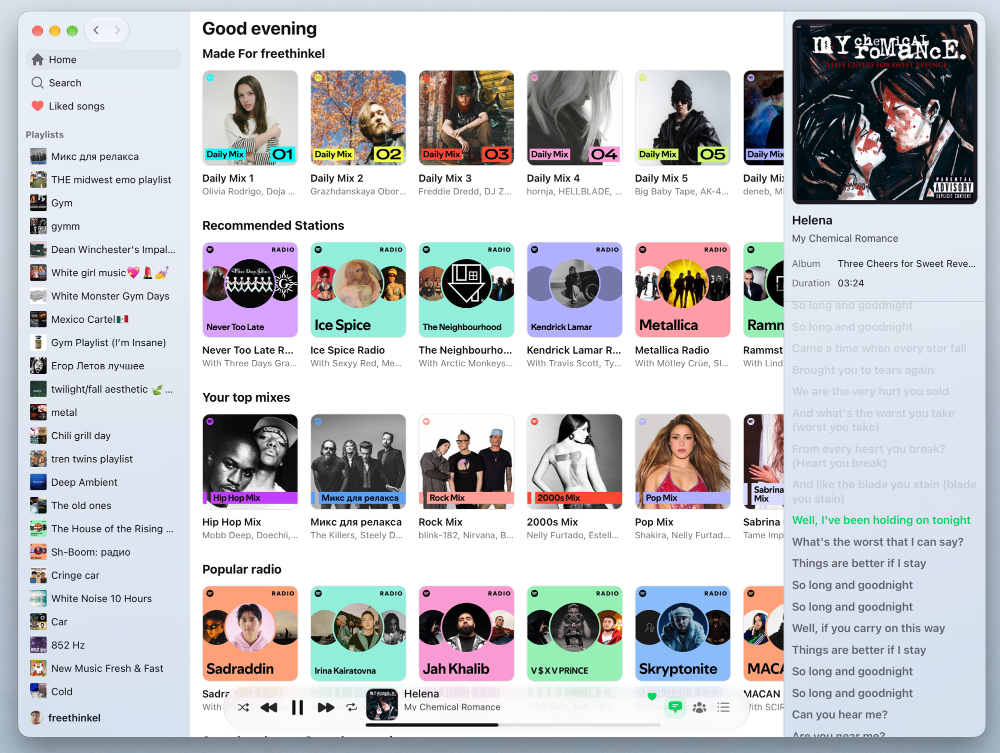

# Yfitops

Spotify client for macOS on Tauri 2 and SvelteKit 5. One small window instead of the Electron one.



## What works

- Home: daily mixes, stations, top mixes, radio
- Playlists, liked songs, search
- Player with shuffle and repeat, plus a mini window
- Synced lyrics
- Friends activity
- Light and dark themes, translations

## Run it

```sh
pnpm install
pnpm tauri dev
```

`pnpm check`, `pnpm lint`, `pnpm format`, `pnpm check:i18n` do what they say.

## Build

```sh
pnpm tauri build
```

CI builds a release on `v*` tags. The tag has to match the version in `src-tauri/tauri.conf.json` and `package.json`, otherwise the job fails.

## License

MIT
